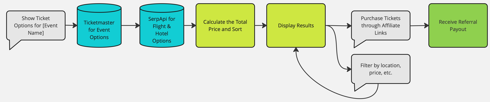
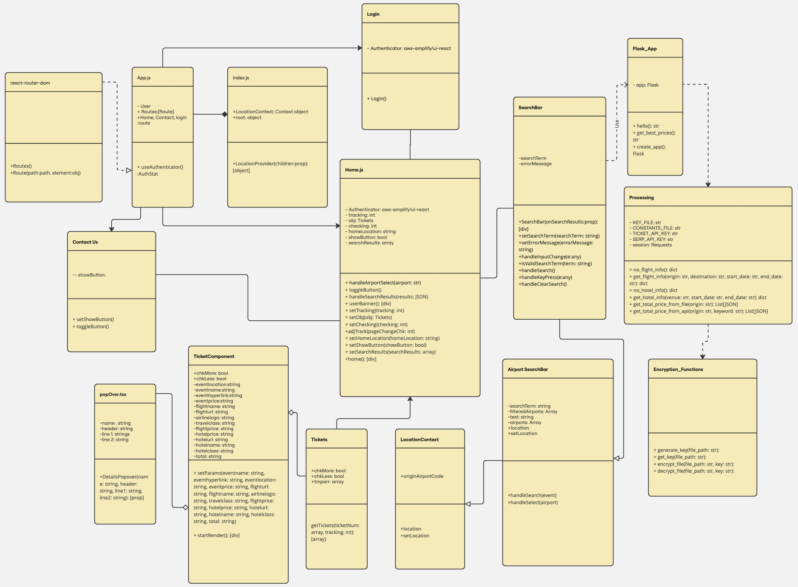

- [Get-Ur-Tickets](#get-ur-tickets)
  - [Production Deployment](#production-deployment)
    - [AWS Amplify Frontend](#aws-amplify-frontend)
    - [Python Anywhere Backend](#python-anywhere-backend)
      - [Load Balancer Server](#load-balancer-server)
      - [Load Balancer Code](#load-balancer-code)
      - [Deployment Steps](#deployment-steps)
  - [Local Development](#local-development)
    - [Frontend](#frontend)
      - [Optional](#optional)
    - [Backend](#backend)
    - [Docker](#docker)
  - [How the application works](#how-the-application-works)

# [Get-Ur-Tickets](https://main.d356ozzs66r3xx.amplifyapp.com/)

## Production Deployment
### [AWS Amplify Frontend](https://main.d356ozzs66r3xx.amplifyapp.com/)
The frontend uses CI / CD (Continuous Integration / Continuous Deployment) and will redeploy upon merging.

### [Python Anywhere Backend](https://GetUrTickets.pythonanywhere.com/)
Our backend application was deployed on [Python Anywhere's free plan](https://www.pythonanywhere.com/pricing/). This means the backend application only has 1 web worker per web app, and will queue multiple requests while the front of the queue is being processed.

A workaround solution was made for the aforementioned problem. We deployed a load balancer on Python Anywhere and built multiple servers to provide faster responses to when the server gets overloaded. The problem with this approach is that when updates or changes are added to the backend, because each server has to be updated individually since they are spread across different accounts.

#### [Load Balancer Server](https://loadbalancer8888.pythonanywhere.com/)
#### [Load Balancer Code](./load-balancer/flask_app.py)
The load balancer is a simple round robin load balancer. The servers it sends to requests to can be found in its code.

#### Deployment Steps
Setting up web domain
1. Select the web tab 
2. Click add a new web app, then click next
3. Select your python webframe, select flask, click next
4. Select your python version, Python 3.10, click next, click next again
1. Switch to the Console tab
   1. Open a bash console
        - `git clone https://github.com/CS-472/Get-Ur-Tickets `
   2. Navigate to the project directory
   3. Pull the most up-to-date code from the repository
        - `git pull`

2. Switch to the Web tab
   1. Ensure to set the Source code and Working directory to backend: `/home/websitename/Get-Ur-Tickets/backend`
   2. Ensure the Virtualenv path is set - must make this in console
        - In backend directory run `pip install pipreqs`
    3. Then run `pipreqs . --force`
    4. Then run `python -m venv venv`
    5. Then run `source venv/bin/`
    4. Activate the virtual environment
   - Windows
     - `.\venv\Scripts\activate`
   - MacOS
     - `source venv/bin/activate`
    7. Then run `pip install -r requirements.txt`
    7. Then run `pip install --upgrade flask werkzeug`
    8. Then set Virualenv to the location of the venv.
    9. Configure the WSGI configuration file by clicking on the location
        - Set your `project_home` to the pwd of ur backend, `should be the same as source and working directory`.
    
     10. Click the green reload button at the top of the page
## Local Development
### Frontend
1. Go to the frontend directory
   - `cd get-ur-tickets`
2. Install all of the dependencies
    - `npm install`
3. Build the application
    - `npm run build`
4. Serve the application using waitress
    - `serve -s build`

#### Optional
1. If using a Linux machine, or UNIX machines (needs testing), you may run `chmod +x build.sh` if you wish to use the build script instead. 
2. After enabling the build script for execution, run `./build.sh` in the root directory of your repo git clone.
3. This will run all necessary commands to build/aquire dependencies and prompt you to start the webserver locally if you wish.

### Backend
The entry point of the backend is [flask_app.py](./backend/flask_app.py)

1. Change directories to the backend directory
   - `cd backend`
2. Create requirements.txt
   - `pipreqs .` 
3. Create a virtual environment
   - `python -m venv venv`
4. Activate the virtual environment
   - Windows
     - `.\venv\Scripts\activate`
   - MacOS
     - `source venv/bin/activate`
5. Install Dependencies
    - `pip install -r requirements.txt`
6. Serve the application
   - `waitress-serve --port=80 --call flask_app:create_app`
7. Deactivate Virutal Environment
   - `deactivate`
8. Make POST requests using curl
    ```shell 
    curl -d '{"originAirportCode":"LAS", "keyword":"formula-1"}' -X POST https://GetUrTickets.pythonanywhere.com/result -H "Content-Type: application/json"
    ```
   - If need be, edit the parameters passed by modifying what is inside the curly braces

You can expect the output to be in a JSON format like the following.
```json
[
    {
        "Total_Price": 590.5,
        "Name": "Boston Celtics vs. Detroit Pistons",
        "Venue": "Boston",
        "Ticket_Price": 65.5,
        "Ticket_URL": "https://www.ticketmaster.com/boston-celtics-vs-detroit-pistons-boston-massachusetts-12-04-2024/event/010060EBE46272A8",
        "Flight": {
            "Price": 309,
            "Destination": "BOS",
            "Departure": "2024-12-03",
            "Return": "2024-12-05",
            "URL": "https://www.google.com/travel/flights?hl=en&gl=us&tfs=CBwQAhoeEgoyMDI0LTEyLTAzagcIARIDTEFYcgcIARIDQk9TGh4SCjIwMjQtMTItMDVqBwgBEgNCT1NyBwgBEgNMQVhCAQFIAXABmAEB",
            "Airline": "Spirit",
            "Logo": "https://www.gstatic.com/flights/airline_logos/70px/NK.png",
            "Travel_Class": "Economy"
        },
        "Hotel": {
            "Price": 216,
            "Check-in": "2024-12-03",
            "Check-out": "2024-12-05",
            "URL": "https://www.vrbo.com/3928052?MDPCID=VRBO-META.HPA.WEB-ORGANIC.VR",
            "Name": "Ultra Convenient, Ultra Cozy, Luxury Boston Condo!"
        }
    },
    {
        "Total_Price": 787.5,
        "Name": "Boston Celtics vs. Miami Heat",
        "Venue": "Boston",
        "Ticket_Price": 88.5,
        "Ticket_URL": "https://www.ticketmaster.com/boston-celtics-vs-miami-heat-boston-massachusetts-12-02-2024/event/010060EBE45D729C",
        "Flight": {
            "Price": 403,
            "Destination": "BOS",
            "Departure": "2024-12-01",
            "Return": "2024-12-03",
            "URL": "https://www.google.com/travel/flights?hl=en&gl=us&tfs=CBwQAhoeEgoyMDI0LTEyLTAxagcIARIDTEFYcgcIARIDQk9TGh4SCjIwMjQtMTItMDNqBwgBEgNCT1NyBwgBEgNMQVhCAQFIAXABmAEB",
            "Airline": "Spirit",
            "Logo": "https://www.gstatic.com/flights/airline_logos/70px/NK.png",
            "Travel_Class": "Economy"
        },
        "Hotel": {
            "Price": 296,
            "Check-in": "2024-12-01",
            "Check-out": "2024-12-03",
            "URL": "",
            "Name": "2 Pool View Units, 5-minute walk to Back Bay Fens! Valet Parking, Pool, Garden!"
        }
    },
    {
        "Total_Price": 1012.0,
        "Name": "Chicago Bulls vs. Boston Celtics",
        "Venue": "Chicago",
        "Ticket_Price": 89.0,
        "Ticket_URL": "https://www.ticketmaster.com/chicago-bulls-vs-boston-celtics-chicago-illinois-11-29-2024/event/04006110BC0D46BE",
        "Flight": {
            "Price": 571,
            "Destination": "ORD",
            "Departure": "2024-11-28",
            "Return": "2024-11-30",
            "URL": "https://www.google.com/travel/flights?hl=en&gl=us&tfs=CBwQAhoeEgoyMDI0LTExLTI4agcIARIDTEFYcgcIARIDT1JEGh4SCjIwMjQtMTEtMzBqBwgBEgNPUkRyBwgBEgNMQVhCAQFIAXABmAEB",
            "Airline": "Spirit",
            "Logo": "https://www.gstatic.com/flights/airline_logos/70px/NK.png",
            "Travel_Class": "Economy"
        },
        "Hotel": {
            "Price": 352,
            "Check-in": "2024-11-28",
            "Check-out": "2024-11-30",
            "URL": "https://www.marriott.com/en-us/hotels/chidx-hotel-emc2-autograph-collection/overview/?scid=f2ae0541-1279-4f24-b197-a979c79310b0",
            "Name": "Hotel EMC2, Autograph Collection"
        }
    }
]
```

### Docker
1. Commands to build and run 
   - To build the container issue the command `docker build -t get-ur-tickets-app .`
   - To run the container issue the command  `docker run -p 3000:3000 get-ur-tickets-app`
2. Build Phase:
   - When the Docker file is built it will do the following: 
   - Download the node.js 16 image
   - Create a working directory in the `/app` container
   - Copy the package.json files
   - Run `npm install` to install dependencies 
3. Run Phase:
   - When the Docker file is ran it will do the following:
   - Expose port 3000 in the container to port 3000 on your local machine
   - Start the Node.js application using npm start 
   - The application will be accessible on your local machine at `http://localhost:3000`
4. FAQ:
   - Ensure Docker is installed on your computer.
   - The initial build will take approximately 2 minutes.
   - If the build fails and the error you encounter is 401 unauthorized, make sure you are logged into Docker on your terminal. 
   - The command to log in is `docker login -u <username>`
  
## How the application works


GetUrTickets is a RESTful application that works by making GET, POST, PUT, and DELETE requests. The application has a frontend user interface that the user will interact with, and a backend that handles all of the processing of the application. The application will be hosted on Amazon Web Services using [AWS Amplify](https://aws.amazon.com/amplify/). The application will be deployed each time there is a new commit to our team repository.

Based on the diagram at the top. The user will request tickets for a specific (event) on the frontend. The backend will make an API call to SeatGeek for the upcoming events, which will then make an API call to SerpAPI for upcoming flight options based on the result from SeatGeek. After this, the backend will calculate each choice’s total price (tickets + flight), sort, and send the results to the frontend. The frontend will display the results and give the user the choice to filter. After this, the front end will provide the user an option to buy tickets through affiliate links so our application can receive a final payout.

The UML diagram below shows how the application works on a detailed level.


